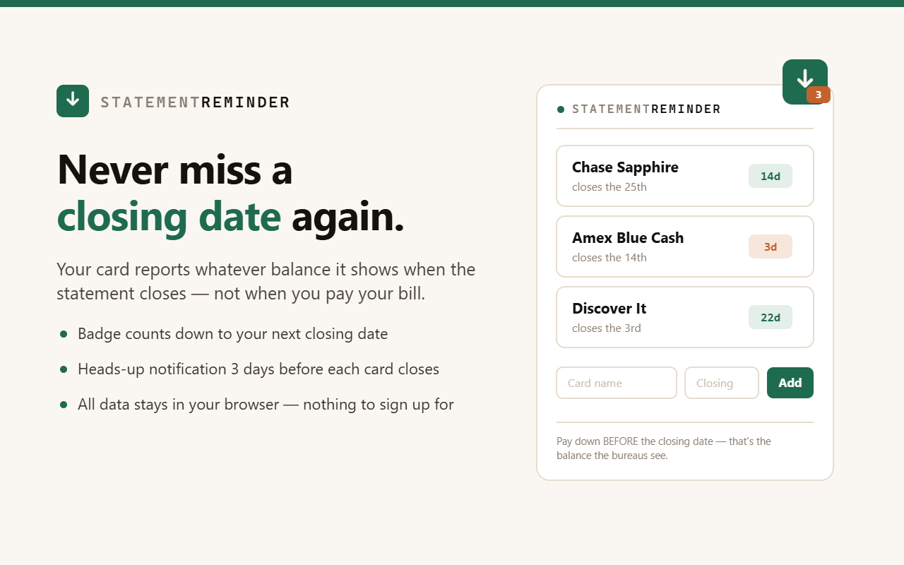

# Statement Reminder

A Chrome extension that makes your credit card's **statement closing date** impossible
to miss — because that's the day your balance gets reported to the credit bureaus, not
your due date.

- Add each card's closing day (a nickname and a day of the month — never an account
  number or login)
- The toolbar badge counts down the days to your next close
- A notification fires 3 days before each card closes — enough time for a payment to post

**Status:** submitted to the Chrome Web Store, review pending. Until it's listed you can
load it unpacked (below).

Pairs with **[ReportsLow](https://ababa1326.github.io/reportslow/)** — the free calculator
that tells you exactly how much to pay down before the snapshot.

## Privacy

No data collection, no servers, no tracking. Card nicknames and closing days live in
Chrome's own `storage.sync`. See [PRIVACY.md](PRIVACY.md).

## Load unpacked (until the store listing is live)

1. Open `chrome://extensions`
2. Turn on **Developer mode**
3. Select **Load unpacked** and choose this directory

## Tech

Manifest V3, vanilla JavaScript, zero dependencies. Permissions: `storage`, `alarms`,
`notifications` — nothing else.
